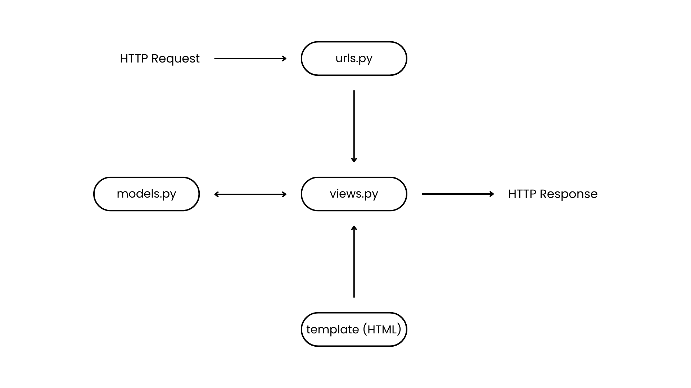

Tautan menuju aplikasi : https://erik-wilbert-burhansportswear.pbp.cs.ui.ac.id/

### Tugas 2
1. Jelaskan bagaimana cara kamu mengimplementasikan checklist di atas secara step-by-step
- Membuat folder proyek local, aktifkan virtual environment, susun requirements.txt, download seluruh dependence atau library yang terdapat pada requirements.txt.
- Inisialisasi git dan buat .gitignore untuk file sensitif yang tidak perlu dicommit, buatkan juga repository baru di github lalu menghubungkan git local ke github dengan menggunakan "remote add origin <link menuju repository>".
- Buatkan proyek Django dengan menggunakan "django-admin startproject <nama project>". Buatkan file .env (development) dan .env.prod (production) dan muat variabelnya di settings.py dengan menggunkan "python-dotenv".
- Buatkan aplikasi main dengan menggunakan "python manage.py startapp <nama aplikasi>" dan mendaftarkannya di settings.py dalam INSTALLED_APPS.
- Mendefinisikan model Product di models.py dengan enam atribut wajib (name, price, description, thumbnail, category, is_featured) dengan tipe field masing-masing, lalu jalankan "python manage.py makemigrations" dan "python manage.py migrate" untuk melakukan perubahan pada model basis data di Django.
- Implementasi MVT dasar dengan sebuah views yang merender template main.html (buatkan main.html di dalam folder baru bernama templates di aplikasi main) berisi html sederhana dengan nama aplikasi, nama lengkap, dan kelas, petakan rute main.html di main/urls.py dan gabungkan ke urls.py utama proyek dengan include.
- Setup PWS dengan buat proyek di PWS, amankan username dan passwordnya, copy isi env.prod ke Environs, dan tambahkan URL PWS proyek ini ke ALLOWED_HOSTS di settings.py, jalankan perintah “Project Command” awal dari PWS.
- Lakukan "git add .", "git commit -m <komentar>", dan "git push origin <main branch>" serta "git push PWS <main branch>" setiap kali melakukan perubahan.

2. Buatlah bagan yang berisi request client ke web aplikasi berbasis Django beserta responnya dan jelaskan pada bagan tersebut kaitan antara urls.py, views.py, models.py, dan berkas html.

Diagram ini menjelaskan alur kerja arsitektur MTV pada Django. Proses dimulai ketika server menerima sebuah HTTP Request, yang kemudian diteruskan ke urls.py untuk menentukan rute dan mengarahkannya ke View (views.py) yang sesuai. Di dalam View, logika aplikasi dijalankan, dan jika diperlukan, View akan berinteraksi dengan Model (models.py) untuk mengambil atau memodifikasi data dari database. Setelah itu, data yang diperoleh dikirim ke Template (.html) untuk dirender menjadi halaman web. Hasil render tersebut kemudian dikembalikan ke pengguna sebagai sebuah HTTP Response dalam bentuk dokumen HTML.

3. Jelaskan peran settings.py dalam proyek Django! 
settings.py adalah file konfigurasi utama dalam proyek Django. Semua pengaturan penting proyek didefinisikan di sini, mulai dari daftar aplikasi yang digunakan (INSTALLED_APPS), konfigurasi database, daftar host yang diizinkan (ALLOWED_HOSTS), hingga SECRET_KEY untuk keamanan. Selain itu, file ini juga memungkinkan pemisahan pengaturan antara lingkungan development (saat aplikasi masih dikembangkan di komputer lokal) dan production (saat aplikasi dijalankan di server).

4. Bagaimana cara kerja migrasi database di Django?
Migrasi database di Django adalah proses yang menjaga agar struktur database selalu sesuai dengan definisi model di models.py. Saat developer menambahkan atau mengubah model, Django dapat membuat file migrasi menggunakan perintah makemigrations, yang berisi instruksi tentang perubahan apa saja yang harus diterapkan pada database, seperti membuat tabel baru, menambah kolom, atau menghapus field. Setelah itu, perintah migrate dijalankan untuk mengeksekusi file migrasi tersebut dan menerapkan perubahan ke database.

5. Menurut Anda, dari semua framework yang ada, mengapa framework Django dijadikan permulaan pembelajaran pengembangan perangkat lunak? 
Menurut saya, framework Django dijadikan permulaan pembelajaran pengembangan perangkat lunak karena Django menggunakan Model-View-Template (MVT) yang sangat jelas dan terstruktur, yang memisahkan data, logika, dan tampilan, yang membuatnya menjadi permulaan karena alur aplikasi awal yang terlihat jelas, terstruktur, dan lebih mudah dipahami.

6. Apakah ada feedback untuk asisten dosen tutorial 1 yang telah kamu kerjakan sebelumnya?
Asisten dosen tutorial 1 cukup membantu walaupun dilaksanakan secara online, asisten dosen membantu melalui platform yang tersedia, asisten dosen mampu membantu menangani error yang membingungkan bagi kita.

### Tugas 3
1. Jelaskan mengapa kita memerlukan data delivery dalam pengimplementasian sebuah platform?
Data delivery diperlukan dalam pengimplementasian sebuah platform karena menjadi mekanisme utama pertukaran informasi antar komponen sistem, seperti antara frontend dan backend. Dengan adanya data delivery, aplikasi dapat menampilkan data secara dinamis, memungkinkan interaksi dua arah dengan server, serta memastikan sistem yang berbeda bisa saling berkomunikasi dengan baik. 

2. Menurutmu, mana yang lebih baik antara XML dan JSON? Mengapa JSON lebih populer dibandingkan XML?
JSON lebih unggul dibandingkan XML karena memiliki struktur yang lebih sederhana, ringan, mudah dibaca, serta lebih cepat diproses. Meskipun XML mendukung struktur data kompleks, formatnya cenderung verbose dan kurang efisien untuk kebutuhan pertukaran data modern. JSON menjadi lebih populer karena strukturnya mirip objek JavaScript, sehingga integrasi dengan aplikasi web jauh lebih mudah dan mendapat dukungan luas dari berbagai bahasa pemrograman.

3. Jelaskan fungsi dari method is_valid() pada form Django dan mengapa kita membutuhkan method tersebut?
Method is_valid() pada form Django berfungsi untuk memvalidasi data yang dikirimkan pengguna. Method ini mengecek kesesuaian data dengan tipe field, memastikan field wajib terisi, serta menjalankan aturan validasi tambahan. Jika valid, is_valid() mengembalikan nilai True dan data bersih dapat diakses melalui cleaned_data; jika tidak valid, method ini mengembalikan False sekaligus menyimpan pesan error untuk ditampilkan di template. 

4. Mengapa kita membutuhkan csrf_token saat membuat form di Django? Apa yang dapat terjadi jika kita tidak menambahkan csrf_token pada form Django? Bagaimana hal tersebut dapat dimanfaatkan oleh penyerang?
CSRF token dibutuhkan pada form Django untuk mencegah serangan Cross-Site Request Forgery (CSRF), yaitu upaya penyerang memanfaatkan sesi login pengguna untuk menjalankan aksi berbahaya tanpa sepengetahuan mereka. Token ini berfungsi sebagai verifikasi bahwa request benar-benar berasal dari form sah milik aplikasi. Tanpa CSRF token, penyerang dapat menyisipkan form palsu atau link berbahaya yang mengirimkan request otomatis, misalnya mengubah data penting atau melakukan transaksi.

5. Jelaskan bagaimana cara kamu mengimplementasikan checklist di atas secara step-by-step (bukan hanya sekadar mengikuti tutorial).
- Import module HttpResponse dari django.http dan serializers dari django.core.
- Membuat 4 fungsi baru di main/views.py bernama show_xml dengan parameter "response", show_json dengan parameter "response", show_xml_by_id dengan parameter "response" dan "product_id", show_json_by_id dengan parameter "response" dan "product_id".
- Pada show_xml, mendefinisikan product_list dengan mengambil semua product yang ada, ubah queryset menjadi format XML dan membalikan data (response) ke client dalam bentuk XML.
- Pada show_json, mendefinisikan product_list dengan mengambil semua product yang ada, ubah queryset menjadi format JSON dan membalikan data (response) ke client dalam bentuk JSON.
- Pada show_xml_by_id, mendefinisikan produt_item dengan cari produk berdasarkan primary key (id) menggunakan filter, kalau ketemu, ubah ke format XML dan dikirim balik ke client.
- Pada show_json_by_id, mendefinisikan produt_item dengan cari produk berdasarkan primary key (id) menggunakan filter, kalau ketemu, ubah ke format JSON dan dikirim balik ke client.
- Menambahkan semua routing urls masing-masing views yang telah dibuat tadi fungsinya dalam main/urls.py.
- Tambahkan tombol add pada main.html untuk redirect ke form nantinya dan membuat templates create_product dan product_detail pada main/templates/ untuk digunakan nantinya dan base.html di roots/templates/ sebagai template dasar.
- Membuat halaman form dengan templates create_product dan konfigurasinya pada forms.py.
- Menambahkan tampilan produk-produk pada main.html jika terdapat produk dan halaman product_detail untuk menampilkan detail produk.
- Lakukan "git add .", "git commit -m <komentar>", dan "git push origin <main branch>" serta "git push PWS <main branch>" setiap kali melakukan perubahan.

6. Apakah ada feedback untuk asdos di tutorial 2 yang sudah kalian kerjakan?
Selama tutorial 2 masih aman dan baik.

### Tugas 4
1. Apa itu Django AuthenticationForm? Jelaskan juga kelebihan dan kekurangannya.
Django AuthenticationForm adalah form bawaan yang disediakan oleh Django untuk menangani proses login pengguna dengan menyediakan field username dan password serta melakukan validasi langsung terhadap data yang dimasukkan berdasarkan model User. Kelebihan dari AuthenticationForm adalah sifatnya yang siap pakai tanpa perlu membuat form login dari awal, terintegrasi penuh dengan sistem autentikasi Django melalui fungsi authenticate() dan login(), memiliki validasi otomatis untuk username dan password yang salah, serta fleksibel untuk diperluas jika dibutuhkan field tambahan seperti “remember me”. AuthenticationForm memiliki kekurangan seperti hanya mendukung login berbasis username dan password sehingga tidak cukup fleksibel apabila aplikasi membutuhkan metode autentikasi lain seperti login dengan email, OTP, atau Single Sign-On (SSO), sehingga dalam penggunaannya sering memerlukan subclassing atau overriding agar sesuai dengan kebutuhan tertentu.

2. Apa perbedaan antara autentikasi dan otorisasi? Bagaiamana Django mengimplementasikan kedua konsep tersebut? 
Perbedaan antara autentikasi dan otorisasi terletak pada fungsi serta proses yang dijalankannya. Autentikasi merupakan proses verifikasi identitas pengguna misalnya melalui login dengan username dan password, sedangkan otorisasi adalah proses pemberian hak akses setelah identitas terverifikasi seperti admin yang dapat menghapus data sementara pengguna biasa hanya dapat membaca. Django mengimplementasikan autentikasi melalui modul django.contrib.auth yang menyediakan backend autentikasi, fungsi authenticate() untuk memverifikasi kredensial, serta fungsi login() untuk menyimpan informasi pengguna di session. Otorisasi diimplementasikan melalui sistem permission yang otomatis dibuat untuk setiap model, dekorator seperti @login_required untuk membatasi akses hanya bagi pengguna login, dan metode user.has_perm() atau user.has_module_perms() untuk memeriksa hak akses tertentu, dengan tambahan dukungan custom permissions untuk pengelolaan kontrol akses yang lebih fleksibel.

3. Apa saja kelebihan dan kekurangan session dan cookies dalam konteks menyimpan state di aplikasi web?
Dalam konteks penyimpanan state di aplikasi web, session dan cookies memiliki kelebihan dan kekurangannya masing-masing. Cookies merupakan mekanisme penyimpanan data di sisi client yang sederhana dan ringan sehingga cocok digunakan untuk menyimpan informasi kecil seperti preferensi pengguna, tetapi kelemahannya adalah mudah dimanipulasi, rentan dicuri melalui serangan XSS, serta terbatas ukurannya sekitar 4 KB sehingga tidak cocok untuk data sensitif. Sebaliknya, session menyimpan data di sisi server sementara client hanya menyimpan session ID melalui cookie, sehingga lebih aman karena data tidak langsung terlihat di browser dan dapat menampung informasi yang lebih kompleks. Namun, penggunaan session membebani server karena membutuhkan penyimpanan tambahan dan bisa menimbulkan masalah ketika jumlah pengguna meningkat jika sistem tidak dilengkapi dengan pengaturan skalabilitas yang baik.

4. Apakah penggunaan cookies aman secara default dalam pengembangan web, atau apakah ada risiko potensial yang harus diwaspadai? Bagaimana Django menangani hal tersebut?
Penggunaan cookies dalam pengembangan web tidak sepenuhnya aman secara default karena terdapat risiko seperti serangan XSS yang dapat mencuri cookie, session hijacking yang memungkinkan penyerang mengambil alih identitas pengguna, serta potensi manipulasi cookie jika server tidak melakukan validasi. Untuk mengatasi hal ini, Django menyediakan berbagai lapisan keamanan, seperti mengatur cookie session dengan atribut HttpOnly agar tidak bisa diakses oleh JavaScript, menyediakan opsi atribut Secure supaya cookie hanya dikirim melalui koneksi HTTPS, serta menambahkan middleware bawaan untuk melindungi dari serangan CSRF. Django juga mendukung penggunaan signed cookies yang diberi tanda tangan kriptografi untuk mencegah modifikasi oleh pihak ketiga, dan secara default hanya menyimpan session ID di cookie sementara data sesi sesungguhnya tetap disimpan di sisi server, sehingga keamanan aplikasi dapat terjaga dengan lebih baik.

5. Jelaskan bagaimana cara kamu mengimplementasikan checklist di atas secara step-by-step (bukan hanya sekadar mengikuti tutorial).
- Membuat fungsi register dengan import UserCreationForm dari django.contrib.auth.forms dan messages dari django.contrib di views.py dan tambahkan juga pathnya ke urls.py dan templates html baru dengan nama register.html pada direktori main/templates untuk templates fungsi register.
- Membuat fungsi login dengan import UserCreationForm dan AuthenticationForm dari django.contrib.auth.forms dan authenticate, login dari django.contrib.auth di views.py dan tambahkan juga pathnya ke urls.py dan templates html baru dengan nama login.html pada direktori main/templates untuk templates fungsi register.
- Membuat fungsi logout pada views.py dan tambahkan button logout pada main.html dan tambahkan juga path logout di urls.py.
- Tambahkan dekorator @login_required(login_url='/login) pada fungsi show_main dan show_product di views.py.
- Saya juga membuat fungsi login saya dapat menggunakan dan mendapatkan data dari cookies dan tambahkan timestamp last login di main.html.
- Menghubungkan models User dari bawaan django models dengan Product.
- Membuat fitur filter pada fungsi show_main di views.py dan tambahkan tombol filter pada main.html.
- Menambahkan nama penjual pada product_detail.html.
- Lakukan "git add .", "git commit -m <komentar>", dan "git push origin <main branch>" serta "git push PWS <main branch>" setiap kali melakukan perubahan.

### Tugas 5
1. Jika terdapat beberapa CSS selector untuk suatu elemen HTML, jelaskan urutan prioritas pengambilan CSS selector tersebut!
Ketika ada beberapa CSS selector yang mengatur elemen yang sama, browser akan menentukan aturan mana yang digunakan berdasarkan prinsip specificity dan cascade. Prioritasnya dimulai dari inline style (paling tinggi), lalu ID selector, kemudian class, pseudo-class, dan attribute selector, setelah itu baru element/tag selector, sedangkan universal selector, inheritance, dan default browser style berada pada prioritas terendah. Jika specificity sama, aturan yang ditulis paling akhir akan dipakai, dan jika ada !important, maka aturan tersebut akan mengalahkan semuanya kecuali ada !important lain dengan tingkat specificity yang lebih tinggi.

2. Mengapa responsive design menjadi konsep yang penting dalam pengembangan aplikasi web? Berikan contoh aplikasi yang sudah dan belum menerapkan responsive design, serta jelaskan mengapa!
Responsive design adalah pendekatan dalam pengembangan web agar tampilan aplikasi menyesuaikan ukuran layar perangkat seperti desktop, tablet, atau smartphone, sehingga pengguna tetap nyaman tanpa harus melakukan zoom atau scroll horizontal. Konsep ini penting karena mayoritas pengguna internet saat ini mengakses melalui perangkat mobile, sehingga web yang tidak responsive akan menurunkan pengalaman pengguna dan ranking SEO. Misalnya, Instagram Web sudah menerapkan responsive design sehingga tampilannya menyesuaikan di layar ponsel maupun laptop, sedangkan beberapa situs lama atau portal berita kuno masih menggunakan ukuran tetap sehingga sulit dibaca di layar kecil.

3. Jelaskan perbedaan antara margin, border, dan padding, serta cara untuk mengimplementasikan ketiga hal tersebut!
Dalam CSS box model, margin, border, dan padding memiliki fungsi berbeda. Margin adalah jarak luar elemen yang memisahkannya dari elemen lain di sekitarnya, border adalah garis yang mengelilingi elemen sebagai pembatas antara isi dan luar elemen, sedangkan padding adalah ruang di dalam border yang memisahkan konten dari garis batas elemen. Ketiganya dapat diatur dengan CSS, misalnya margin: 20px; border: 2px solid black; padding: 15px; untuk membuat jarak luar, garis tepi, dan jarak isi ke tepi.

4. Jelaskan konsep flex box dan grid layout beserta kegunaannya!
Flexbox dan grid layout adalah sistem layout modern di CSS yang memudahkan pengaturan elemen dibanding metode lama seperti float. Flexbox berfokus pada tata letak satu dimensi (horizontal atau vertikal) dan sangat cocok untuk mengatur item dalam baris atau kolom dengan properti seperti display: flex;, justify-content;, dan align-items;. Sementara itu, grid layout berfokus pada tata letak dua dimensi (baris dan kolom sekaligus), sehingga ideal untuk membuat struktur halaman kompleks menggunakan properti seperti display: grid;, grid-template-columns;, dan gap;. Secara ringkas, flexbox lebih cocok untuk mengatur isi komponen, sedangkan grid lebih tepat digunakan untuk mengatur keseluruhan layout halaman.

5. Jelaskan bagaimana cara kamu mengimplementasikan checklist di atas secara step-by-step (bukan hanya sekadar mengikuti tutorial)!
- Membuat fungsi baru edit_product untuk edit product dan delete_product untuk menghapus product di views.py dan hubungkannya ke http request di urls.py.
- Mengatur konfigurasi static di settings.py dan tambahkan folder baru bernama static di roots.
- Membuat html baru untuk edit_product dan card_product untuk digunakan nanti.
- Membuat folder css di static/ dan tambahkan file global.css untuk css default/global.
- Menambahkan konfigurasi tailwind di base.html agar dapat menggunakan tailwind.
- Menambahkan navbar.html di templates roots untuk navigation bar website dan buatkan konfigurasi untuk mobile dan desktop agar dapat reponsive.
- Menambahkan navbar di main.html dengan include.
- Mendesign seluruh templates di main sesuai yang diinginkan dengan menggunakan tailwind dan html.
- Saya juga menggunakan card_product.html sebagai card untuk product-product yang ada dan hubungkan ke main.html dengan include.
- Saya juga membuat folder baru di static bernama image untuk image yang digunakan pada aplikasi ini dan menambahkan image bernama no-product sebagai default image saat tidak ada product.
- Lakukan "git add .", "git commit -m <komentar>", dan "git push origin <main branch>" serta "git push PWS <main branch>" setiap kali melakukan perubahan.